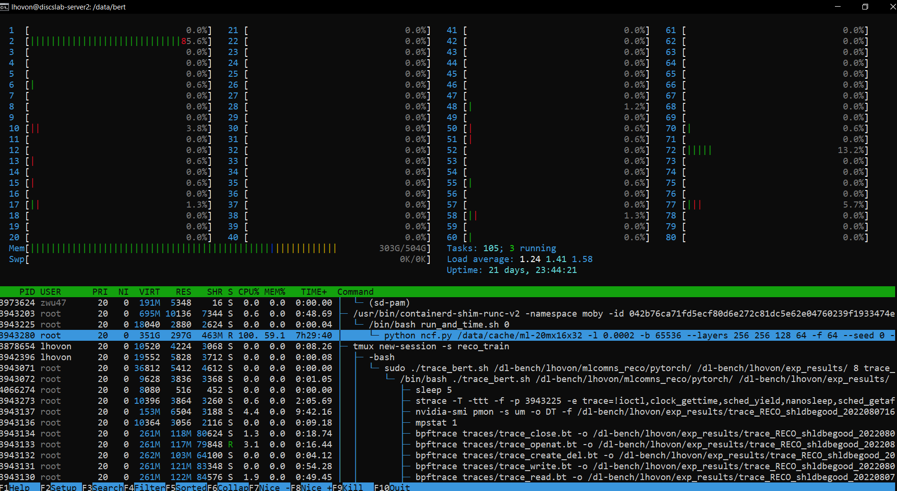

# In your browser:
-	Create a github account
-	Send me an email with your github username so I can add you to our organisation discslab-dl-bench. 

# On the DGX-1:
-	Generate a new SSH keypair by following the ‘Generating a new SSH key’ instructions. Don’t do the ‘Adding your SSH key to the ssh-agent’ part. https://docs.github.com/en/authentication/connecting-to-github-with-ssh/generating-a-new-ssh-key-and-adding-it-to-the-ssh-agent 
-	Add your SSH public key to your github account by following these steps: https://docs.github.com/en/authentication/connecting-to-github-with-ssh/adding-a-new-ssh-key-to-your-github-account 
-	Run `git config --global user.name "<your-github-username>"` and `git config --global user.email "<your-github-email>"` 

Note: you should do the same on the other DISCS server, it might be useful to work on other stuff needing CPU power but not the GPUs like visualizing traces.

These steps will associate your user on the server to your github account, and grant you permissions to the organisation’s repositories.

You will have the right to create branches and push those to the repository. However, the main branch is protected and you will have to open a pull-request to merge your code to it.

The easiest way for us to work on the code together will be for each of us to have our own clones of the repos. Let us each create a directory in /dl-bench for this purpose, where we won’t be limited by the mcgill home directory maximum size (2-3GB). 

-	Go to `/dl-bench` and create a directory with your username

In this directory, you can clone the repositories, esp. the traces and dlio which you will mainly be working on. 

The data for most the workloads is very large however and so we will share copies of them. You can find on `sdb1` mounted on `/raid`. The data for the various workloads is in `/raid/data`.

# Coordinating work on the server

Since we only have one server with GPUs and tracing is sensitive to all activity on the server, we will use a calendar to schedule work.

Before running any trace or intensive job, please check the calendar to see if anyone has reserved the server for their work.

A good command to see what is going on is `htop`. For a better view than the default, I like to go in Setup (F2) and in Display options, check 'Tree view', 'Hide kernel threads', 'Hide userland process threads', 'Display threads in a differnet color', 'Show program path' and 'Highlight large numbers in memory counters'.

That way you will see in the CPU and memory meters at the top if intensive jobs are running. And you can scroll down the list to see what is going on exactly. 

To check the current machine GPU usage you can use `nvidia-smi`. I like the `nvidia-smi pmon -d <delay>` command to show a rolling update every `<delay>` seconds, which I use for the traces.